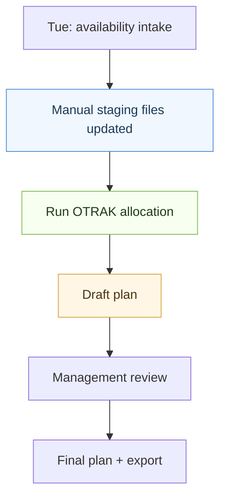

# OTRAK Process (v0)

## Weekly cadence
**Tuesday**: workers submit availability + preferences
**Wednesday 8:00 AM**: draft overtime plan delivered

## Workflow (Mermaid)


## Workflow (text)
```
[Tue: availability intake]
        |
        v
[Manual staging files updated]
  - data/templates/availability.csv
  - data/templates/work_orders.csv
  - data/templates/workers.csv
  - data/templates/ot_totals.csv (optional)
        |
        v
[Run OTRAK allocation]
  - apply eligibility (quals)
  - prioritize critical path
  - score + rank
        |
        v
[Draft plan]
  - assignments + reasons
  - exceptions flagged
        |
        v
[Management review]
  - override with reasons
        |
        v
[Final plan + export]
  - spreadsheet + web view
```

## Inputs (manual staging)
- **Workers**: roster + quals + normal area
- **Availability**: Tue submissions + preferences
- **Work orders**: priority, critical path, required quals, headcount
- **OT totals**: optional fairness data

## Outputs
- Draft plan by Wed 8:00 AM
- Final plan after review + overrides
- Exports: CSV/spreadsheet + web view
